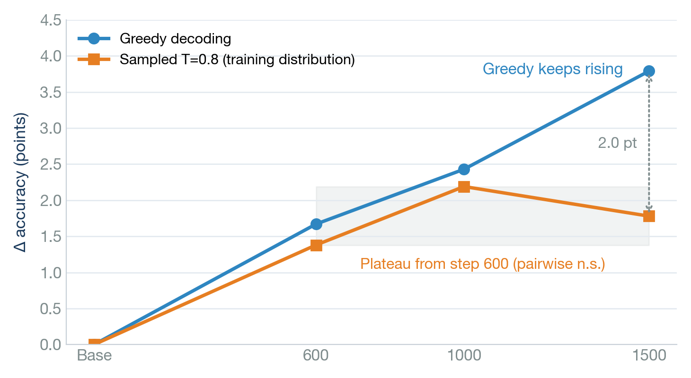
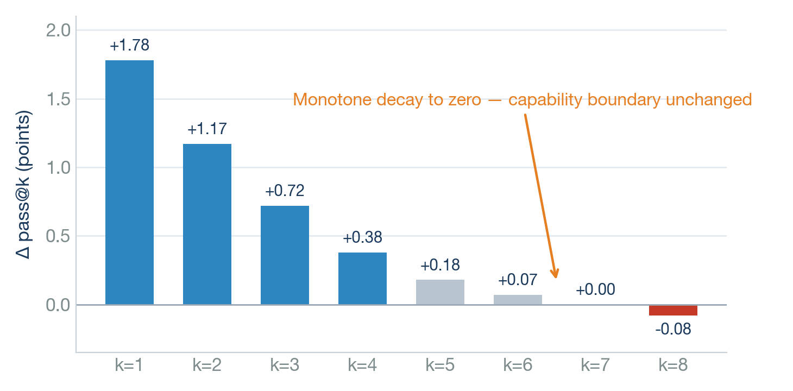
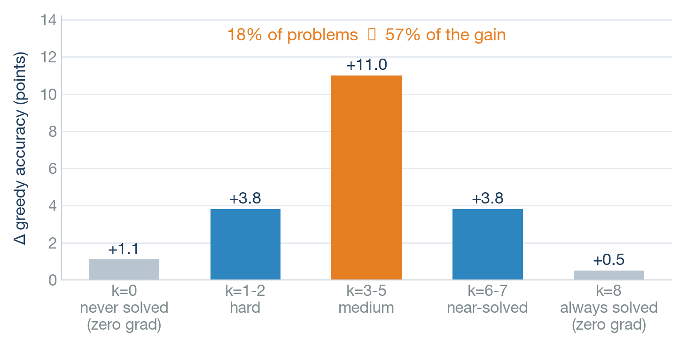
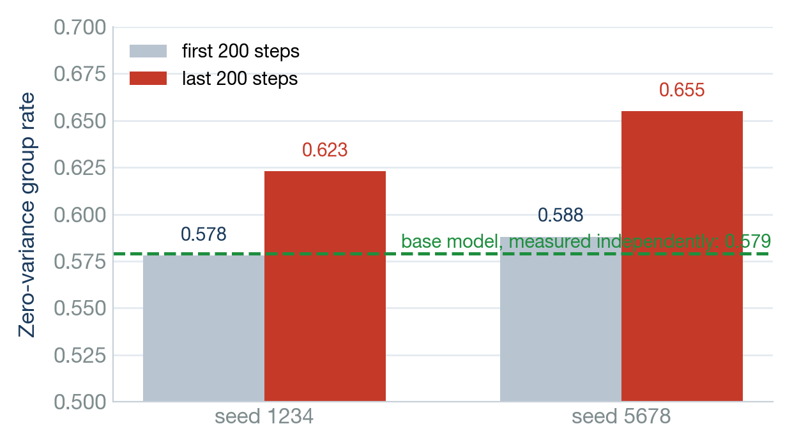

# GRPO + RLVR on a Single RTX 4090

Training Qwen2.5-1.5B-Instruct with GRPO on GSM8K using one 24 GB GPU (~11 GPU·h per run),
and a measurement of **what the resulting gain actually consists of**.

On the full GSM8K test split (1,319 problems), greedy decoding:

| Model | GSM8K test | Δ |
|---|---|---|
| Qwen2.5-1.5B-Instruct | 966/1319 = 73.2% | — |
| + GRPO, 1500 steps, 3 seeds | **77.2%** | **+4.04 ± 0.61** |

The gain is real and consistent across seeds, but it is narrow: the model does not learn to
solve new problems. It comes almost entirely from making *borderline* problems reliably
solvable — which is also why continued training stops helping.

## Experiments

1. **Main result** — GRPO on the GSM8K train split, three seeds, evaluated on held-out test.
2. **Decoding regime** — the same checkpoints under greedy decoding, and under the sampling
   distribution actually used during training (T=0.8, top_p=0.95, 8 samples per problem).
3. **Attribution** — pass@k, difficulty stratification, prompt-template robustness, and
   cross-seed consistency.

## Why Qwen2.5-1.5B-Instruct

Released in September 2024, before RLVR-aware post-training became standard, so it is a
clean baseline for observing what RLVR does on its own. It also fits — with LoRA and
gradient checkpointing — inside a single 24 GB card, which keeps the study cheap to
reproduce.

## Benchmark

GSM8K **test** split, all 1,319 problems, held out from training.

- **Engine**: vLLM, `max_new_tokens=512`.
- **Decoding parameters are always passed explicitly**: `repetition_penalty` and
  `eos_token_id=[151645, 151643]`. HuggingFace `generate` silently inherits the model's
  `generation_config`, where `repetition_penalty` is 1.1 for Qwen2.5, while vLLM defaults
  to 1.0. That 0.1 difference alone moves the measured Δ by two points and the p-value
  from 0.0021 to 0.26 — see [docs/PITFALLS.md](docs/PITFALLS.md).
- **Identical problem set**: every comparison runs on the same slice, enforced by an MD5
  **subset fingerprint**; `compare_results.py` refuses to compare across fingerprints.
- **Statistics**: exact **McNemar** on paired per-problem outcomes; paired **bootstrap**
  confidence intervals for pass-rate comparisons; a separate **interaction test** whenever
  two effects are compared with each other.

## Setup

| | |
|---|---|
| Training | TRL 0.19.1 `GRPOTrainer`, LoRA r=32, rollout with HF `generate` |
| Evaluation | vLLM 0.29 in a separate environment (no `peft`, so adapters are merged first) |

### GRPO configuration

| Parameter | Value |
|---|---|
| Group size G | 8 |
| Micro-batch | 8 completions (= G, one prompt per micro-batch) |
| Gradient accumulation | 2 → 16 completions = **2 prompts per optimizer step** |
| Learning rate | 5e-6, `constant_with_warmup`, warmup ratio 0.03 |
| KL coefficient β | 0.005 |
| Max completion length | 512 |
| Steps | 1500 |

> **On the clip term.** With `num_iterations=1`, each generation batch is consumed by
> exactly one optimizer step, so the importance ratio is identically 1 and `clipped_ratio`
> stays at zero. This is a consequence of the configuration rather than a bug: the run is
> effectively REINFORCE with a group-relative baseline. It is also why the loss can be
> thought of as plain advantage-weighted log-likelihood plus a KL penalty.

### Compute

| Run | GPU | Steps | Wall time |
|---|---|---|---|
| GRPO, 1500 steps (per seed) | 1× RTX 4090 | 1500 | 11 h 08 m |
| Three seeds | 1× RTX 4090 | 4500 | 33 h |
| Pass-rate rating, 1,319 problems × 8 samples (per model) | 1× RTX 4090 | — | ~20 min |
| Full greedy evaluation, 1,319 problems (per model) | 1× RTX 4090 | — | ~3 min |

## Results

| Model (1500 steps, LoRA r32) | GSM8K test | Δ | 95% CI | McNemar p |
|---|---|---|---|---|
| Qwen2.5-1.5B-Instruct (base) | 966/1319 = 73.2% | — | — | — |
| + GRPO · seed 42 | 1012/1319 = 76.7% | +3.49 | [+1.52, +5.53] | 0.0009 |
| + GRPO · seed 1234 | 1018/1319 = 77.2% | +3.94 | [+1.90, +5.99] | 0.0003 |
| + GRPO · seed 5678 | 1028/1319 = 77.9% | +4.70 | [+2.73, +6.75] | 0.0000 |

**Δ = +4.04 ± 0.61** (SD over 3 seeds). Each seed is significant on its own and the spread
is 1.2 points. The first seed run happens to be the lowest of the three — the seeds were
fixed in advance, not selected after the fact.

## What the gain actually is

### 1. Training sharpens the mode; it does not improve the distribution



Training rollouts are drawn at T=0.8 / top_p=0.95, but the headline number is measured with
greedy decoding. Evaluating both ways gives:

| Steps | Greedy Δ | Sampled Δ |
|---|---|---|
| 600 | +1.67 (p=0.092) | +1.38 |
| 1000 | +2.43 (p=0.017) | +2.19 |
| 1500 | **+3.79** (p=0.0009) | +1.78 |

Greedy keeps rising; the sampled gain is flat from step 600 onward. All three sampled
points lie between +1.4 and +2.2 and are not distinguishable from one another
(1000 → 1500: Δ = −0.41, 95% CI [−1.20, +0.39]).

The interaction between the two regimes is **not significant** (+1.71,
95% CI [−0.43, +3.88]), so the stronger claim that the gain *depends* on the decoding
regime is not supported by this data. What is supported is narrower: under the distribution
the model is actually trained on, the gain stops growing after roughly 600 steps.

### 2. The capability boundary never moved



Unbiased `pass@k`, computed from 8 samples per problem:

| k | 1 | 2 | 3 | 4 | 5 | 6 | 7 | 8 |
|---|---|---|---|---|---|---|---|---|
| Base | 72.0 | 82.0 | 86.2 | 88.6 | 90.2 | 91.3 | 92.1 | **92.8** |
| +GRPO | 73.8 | 83.2 | 86.9 | 89.0 | 90.3 | 91.3 | 92.1 | **92.7** |
| **Δ** | **+1.78** | +1.17 | +0.72 | +0.38 | +0.18 | +0.07 | **+0.00** | **−0.08** |

Counting how each problem's pass count changes between base and GRPO:

```
k=0   → k>0     newly solvable          33
k>0   → k=0     no longer solvable      34     net −1
1≤k<8 → k=8     became reliable        143
k=8   → k<8     became unreliable      100     net +43
```

143 problems became reliably solvable and 100 stopped being so, but the set of problems
the model can solve *at all* is unchanged.

### 3. The gain is concentrated in the middle



| Base pass count | Problems | Δ greedy | Share of the net gain |
|---|---|---|---|
| k=0 (never solved) | 95 | +1.1 | 1 |
| k=1-2 | 132 | +3.8 | 5 |
| **k=3-5 (medium)** | **236** | **+11.0** | **26 (57%)** |
| k=6-7 | 289 | +3.8 | 11 |
| k=8 (always solved) | 567 | +0.5 | 3 |

18% of the problems account for 57% of the gain. The two extremes — which are exactly the
zero-variance bands during training, where GRPO receives no gradient — barely move.

### 4. Gradient starvation



GRPO's gradient comes only from groups that have within-group reward variance. The fraction
of zero-variance groups (all 8 correct, or all 8 wrong) measured over training:

```
seed 1234:  first 200 steps 0.578  →  last 200 steps 0.623
seed 5678:  first 200 steps 0.588  →  last 200 steps 0.655
```

It rises rather than falls. The mechanism is the same one as in §1: pushing borderline
problems to "always solved" removes the variance the gradient depends on. The early-training
values agree with an independent measurement on the base model (0.579), which cross-checks
the rating pipeline.

## Reproducing

Two environments are involved and they need different `torch` versions, so they are kept
apart: **training** (TRL + peft) and **evaluation** (vLLM). Below, `python3` means "the
interpreter of the environment named in the section comment", and `$MERGED` is a scratch
path for the merged model (~2.9 GB — keep it outside the repository).

```bash
# ---- training environment ----
pip install "transformers<5" "trl==0.19.1" datasets peft

# data
python3 src/prepare_data.py --task gsm8k
python3 src/prepare_data.py --task gsm8k --split test

# pre-flight checks: peak VRAM, and whether the training set carries a learning signal
python3 src/mem_budget.py --batch-size 8 --num-generations 8 --grad-accum 2 --max-completion-length 512
python3 src/check_baseline.py --task gsm8k --model Qwen/Qwen2.5-1.5B-Instruct --num-problems 20 --num-samples 8

# train
python3 src/train_grpo.py --task gsm8k --use-lora --no-vllm \
    --steps 1500 --num-generations 8 --batch-size 8 --grad-accum 2 \
    --max-completion-length 512 --lr 5e-6 \
    --lr-scheduler-type constant_with_warmup --warmup-ratio 0.03 \
    --beta 0.005 --seed 42 --save-steps 50 --out outputs/run2

# merge the LoRA adapter into a full model; needs peft, so it runs in this environment
MERGED=/tmp/merged1500
python3 src/merge_adapter.py --adapter outputs/run2/checkpoint-1500 --out $MERGED

# ---- evaluation environment (vLLM) ----
# greedy evaluation, 1,319 problems, ~3 minutes per model
python3 src/eval_grpo.py --task gsm8k --model Qwen/Qwen2.5-1.5B-Instruct --out results/base_vllm.json
python3 src/eval_grpo.py --task gsm8k --model $MERGED --out results/rl_greedy.json

# pass-rate rating, 8 samples per problem, ~20 minutes per model
python3 src/filter_by_difficulty.py --model $MERGED --data data/gsm8k_test.jsonl \
    --out data/test_rated_rl.jsonl --out-filtered /tmp/filtered.jsonl

# ---- CPU only ----
python3 src/compare_results.py results/base_vllm.json results/rl_greedy.json   # McNemar + fingerprint
python3 tools/analyze_results.py                                              # six attribution analyses
```

If flashinfer fails to JIT-compile against the system CUDA toolkit, prefix the vLLM commands
with `VLLM_USE_FLASHINFER_SAMPLER=0` (see [docs/PITFALLS.md](docs/PITFALLS.md)).

For multiple seeds, `bash scripts/run_seeds.sh` trains and `bash scripts/eval_seeds.sh`
merges, evaluates and compares. Both take the interpreter paths and the scratch directory
from environment variables (`TRAIN_PY`, `EVAL_PY`, `WORK`). All scripts resolve `data/`,
`results/` and `outputs/` relative to the repository root, so they can be invoked from any
directory.

## Project structure

```
src/        training, evaluation, data preparation, memory budgeting
tools/      analysis and debugging utilities
scripts/    batch runners
docs/       evaluation protocol, engineering pitfalls, detailed results
figures/    plots used in this README
```

## Limitations

- **One model, one task, LoRA.** Published work (Spurious Rewards) shows that effects of
  this kind are strongly model-dependent, so the conclusions are not claimed to transfer to
  other model families or to full fine-tuning.
- **pass@k only up to k=8.** Enough to show the boundary is unchanged at the margin, not
  enough to reproduce the large-k crossover reported in the literature (k=128+).
- **The sampled-regime comparison uses a single seed.** Only the greedy condition was
  replicated across three seeds, so "the sampled gain saturates" is a single-run result.
- **Rollouts use HF `generate`, not vLLM.** GPU utilisation during rollout is only ~22%,
  which suggests meaningful headroom. Switching engines would change the sampling
  distribution and would require re-running every baseline, so it was left alone.

## Conclusion

On this setup GRPO raises greedy accuracy from 73.2% to 77.2%, consistently across seeds.
What it does not do is make the model capable of solving anything it could not already
solve: the capability boundary is unchanged, and the reward signal comes entirely from
re-weighting problems that were already on the edge of being solvable. Because moving those
problems to "reliably solved" also removes the within-group variance the algorithm needs,
the policy runs out of gradient — and from roughly step 600 onward, additional training
only sharpens the mode without improving the distribution it samples from.

## License

MIT
