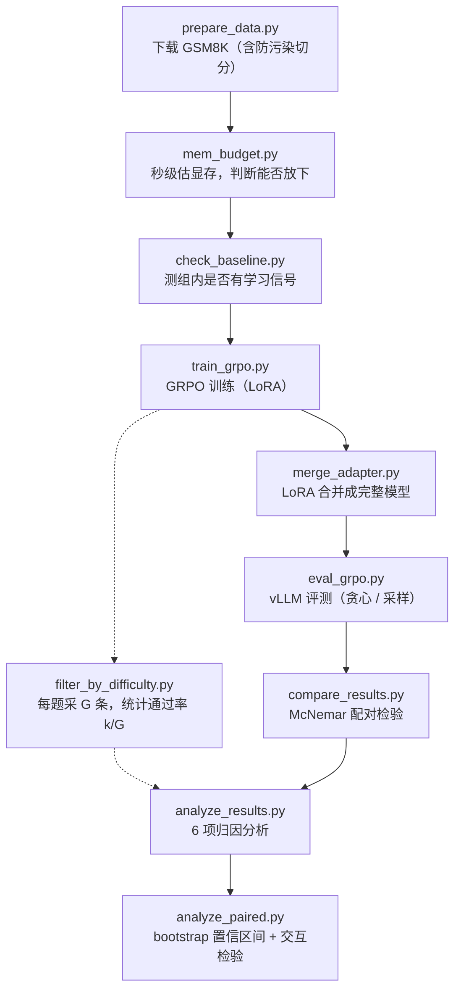

# LLM-RLVR-GRPO

在**单张 4090** 上跑通 GRPO + RLVR：Qwen2.5-1.5B 做 GSM8K，贪心准确率 **73.2% → 77.2%**
（Δ = **+4.04 ± 0.61**，3 个种子），单次训练 11 GPU·h ≈ ¥22。

但比这个数字更重要的是**训练究竟改进了什么**：RL 只把「边缘会做的题」变稳定，
**能力边界（pass@k）完全没有扩大**。

> English: GRPO + RLVR post-training on a single RTX 4090 — and an analysis of what the gain
> actually consists of (sharpening the mode, not expanding the capability boundary).

## 流程图



实线是主流水线，虚线是诊断/分析支线。**每一步都能独立运行、产物落盘。**

## 关键结果

| 模型（1500 步 / LoRA r32）| GSM8K test | Δ |
|---|---|---|
| Qwen2.5-1.5B-Instruct（基座）| 966/1319 = **73.2%** | — |
| + GRPO，3 个种子（42 / 1234 / 5678）| **77.2%** | **+4.04 ± 0.61** |

三条主要发现：

- **训练只锐化众数，不改善分布** —— 贪心口径一路上升（+1.67 → +3.79），
  但训练真正使用的采样口径从 600 步起就饱和（+1.4 ~ +2.2）
- **能力边界没动** —— pass@k 的 Δ 从 +1.78 单调衰减到 −0.08；
  按题统计，「从不会到会」净 **−1** 道，「变成稳定会做」净 **+43** 道
- **一个静默默认参数能翻转结论** —— `repetition_penalty` 静默继承 1.1 时 Δ = +1.4（p=0.26，不显著），
  显式传 1.0 时 Δ = +3.3（p=0.0021）

完整数字、机制闭环、四条可迁移的方法论发现 → **[docs/RESULTS.md](docs/RESULTS.md)**
评测协议与工程踩坑 → **[docs/PITFALLS.md](docs/PITFALLS.md)**

## 快速开始

```bash
# 1. 环境（★ 必须钉版本：只声明下界的依赖会装出不兼容的大版本，见 PITFALLS）
pip install "transformers<5" "trl==0.19.1" datasets peft
#    国内另需：export HF_ENDPOINT=https://hf-mirror.com

# 2. 数据
python3 src/prepare_data.py --task gsm8k               # 训练集 7473 题
python3 src/prepare_data.py --task gsm8k --split test   # 评测集同格式副本（筛题/分析用）

# 3. ★ 开跑前先算显存（秒级，不占 GPU）
python3 src/mem_budget.py --batch-size 8 --num-generations 8 --grad-accum 2 --max-completion-length 512
#    看结尾的「✅ 放得下 / ❌ 大概率 OOM」再决定是否开跑

# 4. ★ 训练前必做：检查有没有学习信号
python3 src/check_baseline.py --task gsm8k --model Qwen/Qwen2.5-1.5B-Instruct --num-problems 20 --num-samples 8
#    看「★ 有信号的题比例」：≥50% 才继续

# 5. 正式训练（多跑几个种子用 scripts/run_seeds.sh）
python3 src/train_grpo.py --task gsm8k --use-lora --no-vllm \
    --steps 1500 --num-generations 8 --batch-size 8 --grad-accum 2 \
    --max-completion-length 512 --lr 5e-6 \
    --lr-scheduler-type constant_with_warmup --warmup-ratio 0.03 \
    --beta 0.005 --seed 42 --save-steps 50 --out outputs/run2

# 6. 合并 adapter（vLLM 不直接吃 LoRA）★ 用 base 环境：venv-vllm 没装 peft
/root/miniconda3/bin/python3 src/merge_adapter.py \
    --adapter outputs/run2/checkpoint-1500 --out /root/autodl-tmp/merged1500

# 7. 评测（held-out 全量 1319 题）
VLLM_USE_FLASHINFER_SAMPLER=0 /root/venv-vllm/bin/python src/eval_grpo.py \
    --task gsm8k --model Qwen/Qwen2.5-1.5B-Instruct --out results/base_vllm.json
VLLM_USE_FLASHINFER_SAMPLER=0 /root/venv-vllm/bin/python src/eval_grpo.py \
    --task gsm8k --model /root/autodl-tmp/merged1500 --out results/rl_greedy.json
python3 src/compare_results.py results/base_vllm.json results/rl_greedy.json

# 8. 训练分布口径（关键对照）：每题采 8 条算通过率
VLLM_USE_FLASHINFER_SAMPLER=0 /root/venv-vllm/bin/python src/filter_by_difficulty.py \
    --model /root/autodl-tmp/merged1500 --data data/gsm8k_test.jsonl \
    --out data/test_rated_rl.jsonl --out-filtered /tmp/x.jsonl

# 9. 一次跑完全部归因分析（不需要 GPU）
python3 tools/analyze_results.py
```

> **目录约定**：所有脚本都用**仓库根目录**下的相对路径（`data/`、`results/`、`outputs/`），
> 从任何地方调用都可以。训练产物和原始结果不入库（见 `.gitignore`）。

## 目录结构

```
src/          核心流水线
  prepare_data.py          数据准备（含防污染切分）
  mem_budget.py            开跑前估显存峰值
  check_baseline.py        训练前测学习信号
  train_grpo.py            GRPO 训练（TRL）
  merge_adapter.py         LoRA → 完整模型
  eval_grpo.py             vLLM 评测
  compare_results.py       对照表 + 指纹校验 + McNemar
  filter_by_difficulty.py  每题采 G 条统计通过率（筛题 / 采样口径评测）
  reward.py                可验证 reward（GSM8K 精确匹配 / 代码执行）

tools/        分析与排查
  analyze_results.py       6 项归因分析（pass@k / 难度分层 / 模板鲁棒性 / …）
  analyze_paired.py        配对 bootstrap 置信区间 + 交互检验
  analyze_length.py        CoT 长度 / 重复度 / 自我纠错标记
  debug_completions.py     打单题 rollout 原文
  debug_train_rollout.py   逐变量隔离排查 rollout 问题

scripts/      一键脚本
  run_seeds.sh             同一配置跑多个种子（可重入）
  eval_seeds.sh            批量合并 → 评测 → 配对分析

docs/
  RESULTS.md               结果、机制、四条发现
  PITFALLS.md              评测协议 + 踩过的坑
  EXPERIMENT_LOG.md        完整实验日志（含被推翻的假设）
```

## 环境

| 项 | 配置 |
|---|---|
| GPU | RTX 4090 24G × 1 |
| 训练环境 | torch 2.5.1+cu124、**transformers 4.57.6**、**trl 0.19.1**、datasets、peft |
| 评测环境 | 独立 venv：vllm 0.29、transformers 5.x（**没装 peft**，所以合并要用训练环境）|
| 训练显存 | 1.5B + LoRA r32 + 梯度检查点，batch8×grad_accum2：预算 13.4 GiB，**实测 15.8 GiB** |
| 预算 | 约 ¥150（75 卡时 × ¥2/h）|

## License

MIT
